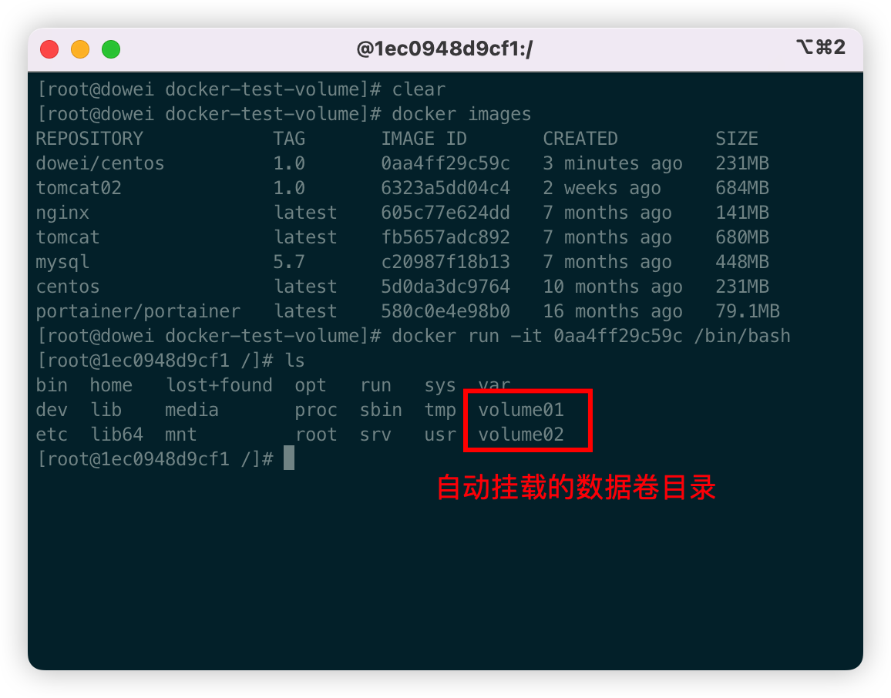

# Docker 概述

## Docker 为什么出现？

开发  -- 运维：自己开发好了，运维出问题

环境配置，每一台机器都要部署

项目环境不能带上环境安装打包，配置环境浪费时间

不能再跨平台，windows 开发，Linux 运行

java --- jar（环境） --- 打包项目带上环境（镜像） --- （Docker 仓库）--- 下载发布的镜像 --- 直接运行即可

隔离：Docker 核心思想！打包集装箱！每个箱子事互相隔离的。

Docker 通过隔离机制，可以将服务器利用到极致。

## Docker 历史

2010 年，几个年轻人在美国成立了一家公司`dotCloud`

做一些 pass 的云计算服务！LXC 有关的容器技术！

他们将机子的技术（容器化技术）命名为 Docker！

刚刚诞生的时候没有引起行业的注意，公司活不下去。

2013 年将 Docker`开源`，现在越来越多人发现了 docker 的优先，然后就火了。

2014 年 4 月 9 日，Docker1.0 发布！

Docker 为什么这么火？十分的轻巧！

虚拟机：通过软件虚拟一台或多台电脑，笨重！

Docker：隔离，镜像十分小巧，运行镜像就可以了，小巧。

虚拟键技术和 Docker 同属于虚拟化技术。

> 聊聊 Docker

Docker 是基于 Go 语言开发的。开源项目

官网：[https://www.docker.com/](https://www.docker.com/)

文档地址：[https://docs.docker.com/](https://docs.docker.com/)

仓库地址：[https://hub.docker.com/](https://hub.docker.com/)

## Docker 能干嘛

虚拟机技术的缺点：

1. 资源占用多
1. 冗余步骤多
1. 启动很慢

> 容器化技术

容器化技术不是模拟一个完整的操作系统

比较 Docker 和虚拟化技术的不同：

- 传统虚拟机，虚拟出一套硬件，运行一个完整的操作系统，然后在这个系统上安装和运行软件
- 容器内的引用直接运行在宿主机的内容，容器时没有自己的内核的，没有虚拟硬件，所以就轻便了。
- 每个容器减都是互相隔离，每个容器都有一个属于自己的文件系统，互不影响

> DevOps (开发、运维)

**更快速的交付和部署**

传统：一堆帮助文档，安装程序

Docker：打包镜像发布测试，一键运行

**更便捷的升级和扩缩容**

使用了 Docker 之后，我们部署应用就和搭积木一样!

项目打包为一个镜像,扩展服务器 A!服务器 B

**更简单的系统运维**

在容器化之后，我没的开发，测试环境都是高度一致的

**更高效的计算机资源利用**

Docker 是内给级别的虚拟化，可以在一个物理机上运行很多的容器实例！服务器的性能可以被压榨到极致

# Docker 安装

## Docker 的基本组成

**镜像（image）：**

docker 镜像就好比是一个模板，课程通过这个模板来创建容器服务，tomcat 镜像==》run==》tomcat01 容器（提供服务器），通过这个镜像可以创建多个容器（最终服务运行或者项目运行就是在容器中的）

**容器（container）：**

Docker 利用容器技术，独立运行一个或者一组应用，通过镜像来创建

启动，停止，删除，基本命令！

目前就可以把这个容器理解为一个简易的 linux 系统

**仓库（repository）：**

存库就是存放镜像的地方！

仓库分为共有仓库和私有仓库！

Docker Hub （默认是国外的）

阿里云... 都有容器服务（配置镜像加速）

## 安装 Docker

> 遇到的问题？
>
> - 无法安装`gnome-terminal`

```shell
 root@dowei:~# sudo apt install gnome-terminal
 Reading package lists... Done
 Building dependency tree
 Reading state information... Done
 E: Unable to locate package gnome-terminal
```

> 问题原因及解决方法：
>
> - 更行本地缓存

```shell
 root@dowei:~# sudo apt update
```

```shell
#1. 删除旧版本
sudo yum remove docker \
                  docker-client \
                  docker-client-latest \
                  docker-common \
                  docker-latest \
                  docker-latest-logrotate \
                  docker-logrotate \
                  docker-engine

#2. 安装软件包
sudo yum install -y yum-utils

#3. 更换阿里云镜像
sudo yum-config-manager \
    --add-repo \
    http://mirrors.aliyun.com/docker-ce/linux/centos/docker-ce.repo

#推荐使用阿里云

#更新软件包索引
yum makecache fast

#4. 安装最新版本的 Docker 引擎、容器和 Docker Compose
sudo yum install docker-ce docker-ce-cli containerd.io docker-compose-plugin

#5. 启动Docker
sudo systemctl start docker

#6. 使用docker version 测试时候安装成功
docker version

#7. 运行hello-world
docker run hello-world

#8. 查看下载的这个 hello-world 镜像
[root@dowei ~]# docker images
REPOSITORY    TAG       IMAGE ID       CREATED        SIZE
hello-world   latest    feb5d9fea6a5   9 months ago   13.3kB
```

## 阿里云镜像加速

1.  登录阿里云，找到容器服务
1.  找到镜像加速地址
1.  配置使用

```shell
sudo mkdir -p /etc/docker

sudo tee /etc/docker/daemon.json <<-'EOF'
{
  "registry-mirrors": ["https://e904wo1v.mirror.aliyuncs.com"]
}
EOF

sudo systemctl daemon-reload

sudo systemctl restart docker
```

## 回顾 hello-world 流程

## 底层原理

**Docker 是什么工作的？**

Docker 是一个 Client -Server 结构的系统，Docker 的守护进程运行在主机上。通过 Socket 从客户端访问！

Docker Server 接收到 Docker-Client 的指令，就会执行这个命令!

**Docker 为什么比 VM 快？**

1. Docker 有着比虚拟机更少的抽象层。
1. docker 利用了宿主机的内核，VM 需要是 Guest OS。

所以说，新建一个容器的时候，docker 不需要虚拟机一样重新加载一个操作系统内核，避免引导。虚拟机时加载 Guest OS，分钟级别的，而 docker 是利用 宿主机的操作系统，省略了这个复杂的过程，秒级！

# Docker 的常用命令

## 帮助命令

```shell
docker version #显示版本信息
docker info    #显示docke人的系统信息，包括镜像和容器的数量
docker 命令 -- help  # 帮助命令
```

## 镜像命令

**docker image 查看主机上的所有镜像**

```shell
[root@dowei ~]# docker images
REPOSITORY    TAG       IMAGE ID       CREATED        SIZE
hello-world   latest    feb5d9fea6a5   9 months ago   13.3kB


# 解释
REPOSITORY	镜像的仓库源
TAG			镜像的标签
IMAGE ID	镜像的id
CREATED		镜像的创建时间
SIZE		镜像的大小

Options:
  -a, --all		# 列出错油镜像
  -q, --quiet	# 只显示镜像的id
```

**docker search 搜索镜像**

```shell
[root@dowei ~]# docker search mysql
NAME                           DESCRIPTION                                     STARS     OFFICIAL   AUTOMATED
mysql                          MySQL is a widely used, open-source relation…   12844     [OK]
mariadb                        MariaDB Server is a high performing open sou…   4922

# 可选项，通过收藏来过滤
--filter=STARS=3000		# 搜索出来的镜像就是STARS大于3000的

[root@dowei ~]# docker search mysql --filter=STARS=3000
NAME      DESCRIPTION                                     STARS     OFFICIAL   AUTOMATED
mysql     MySQL is a widely used, open-source relation…   12844     [OK]
mariadb   MariaDB Server is a high performing open sou…   4922      [OK]
```

**docker pull 下载镜像**

```shell
# 下载镜像 docker pull 镜像名[:tag]
[root@dowei ~]# docker pull mysql
Using default tag: latest	# 如果不写tag，默认就是latest
latest: Pulling from library/mysql
72a69066d2fe: Pull complete 	# 分层下载， docker iamge的核心 联合文件系统
93619dbc5b36: Pull complete
99da31dd6142: Pull complete
626033c43d70: Pull complete
37d5d7efb64e: Pull complete
ac563158d721: Pull complete
d2ba16033dad: Pull complete
688ba7d5c01a: Pull complete
00e060b6d11d: Pull complete
1c04857f594f: Pull complete
4d7cfa90e6ea: Pull complete
e0431212d27d: Pull complete
Digest: sha256:e9027fe4d91c0153429607251656806cc784e914937271037f7738bd5b8e7709	# 签名
Status: Downloaded newer image for mysql:latest
docker.io/library/mysql:latest	# 真实地址

# 等价与它
docker pull mysql
docker pull docker.io/library/mysql:latest

[root@dowei ~]#  docker pull mysql:5.7
5.7: Pulling from library/mysql
72a69066d2fe: Already exists
93619dbc5b36: Already exists
99da31dd6142: Already exists
626033c43d70: Already exists
37d5d7efb64e: Already exists
ac563158d721: Already exists
d2ba16033dad: Already exists
0ceb82207cd7: Pull complete
37f2405cae96: Pull complete
e2482e017e53: Pull complete
70deed891d42: Pull complete
Digest: sha256:f2ad209efe9c67104167fc609cca6973c8422939491c9345270175a300419f94
Status: Downloaded newer image for mysql:5.7
docker.io/library/mysql:5.7
```

**docker rmi 删除镜像**

```shell
[root@dowei ~]# docker rmi -f 镜像id		# 删除指定的镜像
[root@dowei ~]# docker rmi -f 镜像id 镜像id 镜像id 镜像id	# 删除多个镜像
[root@dowei ~]# docker rmi -f $(docker images -aq)		# 删除全部的镜像
```

## 容器命令

**说明：我没有了进项才可以创建容器，Linux，下载一个 centos 镜像来测试学习**

```shell
docker pull centos
```

**新建容器并启动**

```shell
docker run [可选参数] image

# 参数说明
--name="Name"	容器名字	tomcat01 tomcat02	用来区分容器
-d				后台方式运行
-it				使用交互方式运行，进去容器查看内容
-p				指定容器端口 -p 8080:8080
		-p	ip：主机端口：容器端口
		-p	主机端口：容器端口
		-p	容器端口：容器端口
-p				随机指定端口

# 测试，启动并进入容器
[root@dowei ~]# docker run -it centos /bin/bash
[root@4c6600328389 /]# ls	# 查看容器内的centos，基础版本，很多命令都是不完善的
bin  dev  etc  home  lib  lib64  lost+found  media  mnt  opt  proc  root  run  sbin  srv  sys  tmp  usr  var
[root@4c6600328389 /]# exit	# 退出容器
```

**列出所有的运行的容器**

```shell
# docker ps 命令
		# 列出当前运行的容器
-a		# 列出当前正在运行的容器+带出历史运行过的容器
-n=?	# 显示最近创建的容器
-q		# 只显示容器的编号

[root@dowei ~]#  docker ps
[root@dowei ~]#  docker ps -a
CONTAINER ID   IMAGE          COMMAND       CREATED         STATUS                      PORTS     NAMES
4c6600328389   centos         "/bin/bash"   2 minutes ago   Exited (0) 55 seconds ago             romantic_shamir
75dcc3106296   feb5d9fea6a5   "/hello"      4 hours ago     Exited (0) 4 hours ago
```

**退出容器**

```shell
exit # 直接退出容器
ctrl + P + Q	# 容器不停止退出
```

**删除容器**

```shell
docker rm 容器id	# 删除指定的容器，不能删除正在运行的程序，如果强制删除使用 -f
docker rm -f $(docker ps -aq)	#删除所有的容器
docker ps -a -q | xargs docker rm	# 删除所有容器
```

**启动和停止容器的操做**

```shell
docker start 容器id		# 启动容器
docker restart 容器id		# 容器容器
docker stop 容器id		# 停止容器
docker kill 容器id		# 强制停止容器
```

## 常用其他命令

**后台启动容器**

```shell
# 命令 docker run -d 镜像名
[root@dowei ~]# docker run -d centos

# 问题：docker ps发现，centos 停止了

# 常见的坑，docker 容器使用后台运行，就必须要有一个前台进程，docker发现没有云不用，就会停止
# nginx，容器启动后，发现自己没有提供服务，就会立刻停止，就没有程序了
```

**查看日志**

```shell
docker logs -f -t --tail 容器，没有日志

# 自己编写一段shell脚步
docker run -d centos /bin/sh -c "while true;do echo kuangshen;sleep 1;done"

# 显示日志
-tf			# 显示日志
--tail	# 要显示日志的条数
docker logs -ft 容器id
```

**查看容器中的进程信息 ps**

```shell
[root@dowei ~]# docker top 3a7a620fc3cc
UID                 PID                 PPID                C                   STIME               TTY                 TIME                CMD
root                16041               16022               0                   20:24               ?                   00:00:00            /bin/sh -c while true;do echo kuangshen;sleep 1;done
root                16392               16041               0                   20:29               ?                   00:00:00            /usr/bin/coreutils --coreutils-prog-shebang=sleep /usr/bin/sleep 1
```

**查看镜像的元数据**

```shell

# 命令
[root@dowei ~]# docker inspect 3a7a620fc3cc
[
    {
        "Id": "3a7a620fc3ccd9a46e286960dc157624dd3c68cd98ddf376623f408b86b56651",
        "Created": "2022-07-09T12:24:25.409105637Z",
        "Path": "/bin/sh",
        "Args": [
            "-c",
            "while true;do echo kuangshen;sleep 1;done"
        ],
        "State": {
            "Status": "running",
            "Running": true,
            "Paused": false,
            "Restarting": false,
            "OOMKilled": false,
            "Dead": false,
            "Pid": 16041,
            "ExitCode": 0,
            "Error": "",
            "StartedAt": "2022-07-09T12:24:25.767703135Z",
            "FinishedAt": "0001-01-01T00:00:00Z"
        },
        "Image": "sha256:5d0da3dc976460b72c77d94c8a1ad043720b0416bfc16c52c45d4847e53fadb6",
        "ResolvConfPath": "/var/lib/docker/containers/3a7a620fc3ccd9a46e286960dc157624dd3c68cd98ddf376623f408b86b56651/resolv.conf",
        "HostnamePath": "/var/lib/docker/containers/3a7a620fc3ccd9a46e286960dc157624dd3c68cd98ddf376623f408b86b56651/hostname",
        "HostsPath": "/var/lib/docker/containers/3a7a620fc3ccd9a46e286960dc157624dd3c68cd98ddf376623f408b86b56651/hosts",
        "LogPath": "/var/lib/docker/containers/3a7a620fc3ccd9a46e286960dc157624dd3c68cd98ddf376623f408b86b56651/3a7a620fc3ccd9a46e286960dc157624dd3c68cd98ddf376623f408b86b56651-json.log",
        "Name": "/confident_rosalind",
        "RestartCount": 0,
        "Driver": "overlay2",
        "Platform": "linux",
        "MountLabel": "",
        "ProcessLabel": "",
        "AppArmorProfile": "",
        "ExecIDs": null,
        "HostConfig": {
            "Binds": null,
            "ContainerIDFile": "",
            "LogConfig": {
                "Type": "json-file",
                "Config": {}
            },
            "NetworkMode": "default",
            "PortBindings": {},
            "RestartPolicy": {
                "Name": "no",
                "MaximumRetryCount": 0
            },
            "AutoRemove": false,
            "VolumeDriver": "",
            "VolumesFrom": null,
            "CapAdd": null,
            "CapDrop": null,
            "CgroupnsMode": "host",
            "Dns": [],
            "DnsOptions": [],
            "DnsSearch": [],
            "ExtraHosts": null,
            "GroupAdd": null,
            "IpcMode": "private",
            "Cgroup": "",
            "Links": null,
            "OomScoreAdj": 0,
            "PidMode": "",
            "Privileged": false,
            "PublishAllPorts": false,
            "ReadonlyRootfs": false,
            "SecurityOpt": null,
            "UTSMode": "",
            "UsernsMode": "",
            "ShmSize": 67108864,
            "Runtime": "runc",
            "ConsoleSize": [
                0,
                0
            ],
            "Isolation": "",
            "CpuShares": 0,
            "Memory": 0,
            "NanoCpus": 0,
            "CgroupParent": "",
            "BlkioWeight": 0,
            "BlkioWeightDevice": [],
            "BlkioDeviceReadBps": null,
            "BlkioDeviceWriteBps": null,
            "BlkioDeviceReadIOps": null,
            "BlkioDeviceWriteIOps": null,
            "CpuPeriod": 0,
            "CpuQuota": 0,
            "CpuRealtimePeriod": 0,
            "CpuRealtimeRuntime": 0,
            "CpusetCpus": "",
            "CpusetMems": "",
            "Devices": [],
            "DeviceCgroupRules": null,
            "DeviceRequests": null,
            "KernelMemory": 0,
            "KernelMemoryTCP": 0,
            "MemoryReservation": 0,
            "MemorySwap": 0,
            "MemorySwappiness": null,
            "OomKillDisable": false,
            "PidsLimit": null,
            "Ulimits": null,
            "CpuCount": 0,
            "CpuPercent": 0,
            "IOMaximumIOps": 0,
            "IOMaximumBandwidth": 0,
            "MaskedPaths": [
                "/proc/asound",
                "/proc/acpi",
                "/proc/kcore",
                "/proc/keys",
                "/proc/latency_stats",
                "/proc/timer_list",
                "/proc/timer_stats",
                "/proc/sched_debug",
                "/proc/scsi",
                "/sys/firmware"
            ],
            "ReadonlyPaths": [
                "/proc/bus",
                "/proc/fs",
                "/proc/irq",
                "/proc/sys",
                "/proc/sysrq-trigger"
            ]
        },
        "GraphDriver": {
            "Data": {
                "LowerDir": "/var/lib/docker/overlay2/1b2fa1e6569e593260d5f420e9e4361feff86092d96b520c4cb398050882951e-init/diff:/var/lib/docker/overlay2/33f2db8e13068b5270218c0d31d2873d6d1f2160614a34d3b4d5cd6b36cec7e1/diff",
                "MergedDir": "/var/lib/docker/overlay2/1b2fa1e6569e593260d5f420e9e4361feff86092d96b520c4cb398050882951e/merged",
                "UpperDir": "/var/lib/docker/overlay2/1b2fa1e6569e593260d5f420e9e4361feff86092d96b520c4cb398050882951e/diff",
                "WorkDir": "/var/lib/docker/overlay2/1b2fa1e6569e593260d5f420e9e4361feff86092d96b520c4cb398050882951e/work"
            },
            "Name": "overlay2"
        },
        "Mounts": [],
        "Config": {
            "Hostname": "3a7a620fc3cc",
            "Domainname": "",
            "User": "",
            "AttachStdin": false,
            "AttachStdout": false,
            "AttachStderr": false,
            "Tty": false,
            "OpenStdin": false,
            "StdinOnce": false,
            "Env": [
                "PATH=/usr/local/sbin:/usr/local/bin:/usr/sbin:/usr/bin:/sbin:/bin"
            ],
            "Cmd": [
                "/bin/sh",
                "-c",
                "while true;do echo kuangshen;sleep 1;done"
            ],
            "Image": "centos",
            "Volumes": null,
            "WorkingDir": "",
            "Entrypoint": null,
            "OnBuild": null,
            "Labels": {
                "org.label-schema.build-date": "20210915",
                "org.label-schema.license": "GPLv2",
                "org.label-schema.name": "CentOS Base Image",
                "org.label-schema.schema-version": "1.0",
                "org.label-schema.vendor": "CentOS"
            }
        },
        "NetworkSettings": {
            "Bridge": "",
            "SandboxID": "9a488914c7da403de2e16b4dcd72bfb692cbf678cced7e2fe435d5ec36b779f8",
            "HairpinMode": false,
            "LinkLocalIPv6Address": "",
            "LinkLocalIPv6PrefixLen": 0,
            "Ports": {},
            "SandboxKey": "/var/run/docker/netns/9a488914c7da",
            "SecondaryIPAddresses": null,
            "SecondaryIPv6Addresses": null,
            "EndpointID": "1945e03458bae9aca8a959a866a324a9af68047a705cd1edbabb19021495be93",
            "Gateway": "172.17.0.1",
            "GlobalIPv6Address": "",
            "GlobalIPv6PrefixLen": 0,
            "IPAddress": "172.17.0.2",
            "IPPrefixLen": 16,
            "IPv6Gateway": "",
            "MacAddress": "02:42:ac:11:00:02",
            "Networks": {
                "bridge": {
                    "IPAMConfig": null,
                    "Links": null,
                    "Aliases": null,
                    "NetworkID": "81f7bef4311cde6b3652297bd84e472fc553f96f2147800f0f85a42e323f85ab",
                    "EndpointID": "1945e03458bae9aca8a959a866a324a9af68047a705cd1edbabb19021495be93",
                    "Gateway": "172.17.0.1",
                    "IPAddress": "172.17.0.2",
                    "IPPrefixLen": 16,
                    "IPv6Gateway": "",
                    "GlobalIPv6Address": "",
                    "GlobalIPv6PrefixLen": 0,
                    "MacAddress": "02:42:ac:11:00:02",
                    "DriverOpts": null
                }
            }
        }
    }
]

```

**进入正在运行的容器**

```shell
# 容器通常都是使用后台方式运行的，需要进入容器，修改一些配置

# 命令
docker exec -it 容器id

# 测试
[root@dowei ~]# docker exec -it 3a7a620fc3cc /bin/bash
[root@3a7a620fc3cc /]#


#方式2
docker attach 容器id

# 测试
[root@dowei ~]# docker attach 3a7a620fc3cc

# docker exec     # 进入容器后开启一个新的终端，可以在领命操做（常用）
# docker attach   # 进入容器正在执行的终端，不会启动新的进程
```

**从容器内拷贝文件到主机**

```shell
docker cp 容器id：容器内路径 目的主机路径

# 测试

# 进入容器，在/home下创建文件
[root@dowei ~]# docker attach 1cb785715360
[root@1cb785715360 /]# cd home/
[root@1cb785715360 home]# ls
[root@1cb785715360 home]# touch test.java
[root@1cb785715360 home]# exit

# 拷贝到宿主机的/home下并查看
[root@dowei ~]# docker cp 1cb785715360:/home/test.java /home
[root@dowei ~]# ls
dowei.java
[root@dowei ~]# cd /home/
[root@dowei home]# ls
admin  test.java

# 拷贝是一个手动过程，，未来使用 -v 卷的技术，可以实现自动同步
```

## 作业练习

> Docker 安装 Nginx

```shell
# 1. 搜索镜像 search 建议去docker搜索，可以看到帮助文档
# 2. 下载镜像 pull
# 3. 运行测试
[root@dowei ~]# docker images
REPOSITORY   TAG       IMAGE ID       CREATED         SIZE
nginx        latest    605c77e624dd   6 months ago    141MB
centos       latest    5d0da3dc9764   10 months ago   231MB

# -d 后台运行
# --name 给容器命名
# -p 宿主机端口，容器内部端口
[root@dowei ~]# docker run -d --name nginx01 -p 3344:80 nginx
66b28c8e3e223af7e600d9a43dd8154d94e9b117675d8c0997afa450b7a696d2
[root@dowei ~]# docker ps
CONTAINER ID   IMAGE     COMMAND                  CREATED         STATUS         PORTS                  NAMES
66b28c8e3e22   nginx     "/docker-entrypoint.…"   5 seconds ago   Up 4 seconds   0.0.0.0:3344->80/tcp   nginx01
[root@dowei ~]# curl localhost:3344
<!DOCTYPE html>
<html>
<head>
<title>Welcome to nginx!</title>
<style>
html { color-scheme: light dark; }
body { width: 35em; margin: 0 auto;
font-family: Tahoma, Verdana, Arial, sans-serif; }
</style>
</head>
<body>
<h1>Welcome to nginx!</h1>
<p>If you see this page, the nginx web server is successfully installed and
working. Further configuration is required.</p>

<p>For online documentation and support please refer to
<a href="http://nginx.org/">nginx.org</a>.<br/>
Commercial support is available at
<a href="http://nginx.com/">nginx.com</a>.</p>

<p><em>Thank you for using nginx.</em></p>
</body>
</html>
[root@dowei ~]# 

# 进入容器
[root@dowei ~]# docker exec -it nginx01 /bin/bash
root@66b28c8e3e22:/# whereis nginx
nginx: /usr/sbin/nginx /usr/lib/nginx /etc/nginx /usr/share/nginx
root@66b28c8e3e22:/# cd /etc/nginx
root@66b28c8e3e22:/etc/nginx# ls
conf.d  fastcgi_params  mime.types  modules  nginx.conf  scgi_params  uwsgi_params
root@66b28c8e3e22:/etc/nginx# 

# 关闭容器
root@66b28c8e3e22:/etc/nginx# exit
exit
[root@dowei ~]# docker ps
CONTAINER ID   IMAGE     COMMAND                  CREATED          STATUS          PORTS                  NAMES
66b28c8e3e22   nginx     "/docker-entrypoint.…"   14 minutes ago   Up 14 minutes   0.0.0.0:3344->80/tcp   nginx01
[root@dowei ~]# docker stop 66b28c8e3e22
66b28c8e3e22
```

端口暴露的概念


> 作业：docker 来装一个tomcat

``` shell
# 官方使用
docker run -it --rm tomcat:9.0

# 我们之前的启动都是后台，停止了容器之后，容器还是可以查到
# docker run -it --rm，一般用来测试，用完就删

# 下载启动
docker pull tomcat

# 启动运行
[root@dowei ~]# docker images
REPOSITORY   TAG       IMAGE ID       CREATED         SIZE
nginx        latest    605c77e624dd   6 months ago    141MB
tomcat       latest    fb5657adc892   7 months ago    680MB
centos       latest    5d0da3dc9764   10 months ago   231MB
[root@dowei ~]# docker run -d -p 3344:8080 --name tomcat01 tomcat
e4668c8e08dc998171a8e52a4c8a5328a1137915e474b0b437dc06a0a24c0ea0
[

# 测试访问没有问题

# 进入容器
[root@dowei ~]# docker exec -it tomcat01 /bin/bash

#发现问题：1. linux命令少了。2. 没有webapps。阿里云镜像的原因，默认是最小的镜像，所有不必要的剔除掉了
#保证了最小的运行环境
```

> 作业：部署es+kibana

```shell
# es 暴露的端口很多
# es 十分耗内存
# es 的数据一般需要放置到安全目录！挂载
#  --net somenetwork 网络配置

docker run -d --name elasticsearch -p 9200:9200 -p 9300:9300 -e "discovery.type=single-node" elasticsearch:7.6.2
 
# 启动了 linux就卡住了 docker stats 查看cpu的状态

# 测试cs是否成功
[root@dowei ~]# curl localhost:9200
{
  "name" : "2ae513c0a1b0",
  "cluster_name" : "docker-cluster",
  "cluster_uuid" : "vexsPh2mRcWDGzqOKjUQRg",
  "version" : {
    "number" : "7.6.2",
    "build_flavor" : "default",
    "build_type" : "docker",
    "build_hash" : "ef48eb35cf30adf4db14086e8aabd07ef6fb113f",
    "build_date" : "2020-03-26T06:34:37.794943Z",
    "build_snapshot" : false,
    "lucene_version" : "8.4.0",
    "minimum_wire_compatibility_version" : "6.8.0",
    "minimum_index_compatibility_version" : "6.0.0-beta1"
  },
  "tagline" : "You Know, for Search"
}

# 赶紧关闭，增加内存的限制，修改配置文件 -e 环境配置修改 
docker run -d --name elasticsearch03 -p 9200:9200 -p 9300:9300 -e "discovery.type=single-node" -e ES_JAVA_OPTS="-Xms64m -Xmx512m" elasticsearch:7.6.2
```

网络如何连接过去？


## 可视化

- portainer

```shell
docker run -d -p 8088:9000 \--restart=always -v /var/run/docker.sock:/var/run/docker.sock --privileged=true portainer/portainer
```

**什么是portainer？**

Docker图形化管理工具！提供一个后台面板提供我们操作！

访问测试：外网：8088

1. 注册密码
2. 选择local
3. 进入之后的面板

可视化面板平时不会使用。


# Docker镜像讲解


## commit镜像

```shell
docker commit 提交容器成为一个新的副本

#命令和git原理类似
docker commit -m="提交的描述信息" -a="作者" 容器id 目标镜像名：[TAG]
```

实战测试

```shell
# 启动一个默认的tomcat
docker run -it tomcat /bin/bash
docker exec -it de8a9d6a0be4 /bin/bash

# 发现这个默认的tomcat 是没有webapps应用，镜像的原因，官方的镜像默认webapps下面是没有文件的

# 我自己拷贝进去了基本文件
cp -r webapps.dist/* webapps

# 将我们操作过后的容器通过commit提交为一个镜像！我们以后就是用我们修改的镜像即可
[root@dowei ~]# docker commit -a="dowei" -m="add webapps app" de8a9d6a0be4 tomcat02:1.0
sha256:c49815b75076113d28eebf0694efb007eacd02ba14782eb1fe980530488377ae
[root@dowei ~]# docker images
REPOSITORY            TAG       IMAGE ID       CREATED          SIZE
tomcat02              1.0       c49815b75076   19 seconds ago   684MB
nginx                 latest    605c77e624dd   6 months ago     141MB
tomcat                latest    fb5657adc892   7 months ago     680MB
centos                latest    5d0da3dc9764   10 months ago    231MB
portainer/portainer   latest    580c0e4e98b0   16 months ago    79.1MB
elasticsearch         7.6.2     f29a1ee41030   2 years ago      791MB
```

# 容器数据卷

## 什么是容器数据卷

将应用和环境打包成一个镜像！

数据？如果数据都在容器中，那么我们容器删除，数据就会丢失！需求：**数据持久化**

MySql，容器删了，删库跑路！需求：**MySql数据可以存储在本地！**

容器之间可以有一个数据共享的技术！Docker容器中产生的数据，同步到本地

这就是卷技术！目录挂载，将我们容器的目录，挂载到Linux上面！


**总结一句话：容器的持久化和同步操作！容器间也是可以数据共享的**

## 使用数据卷

> 方式一：直接使用命令来挂载 -v

```shell
docker run -it -v 主机目录：容器内部目录

# 测试 
docker run -it -v /home/ceshi:/home centos /bin/bash
```


测试文件的同步


再来测试

1. 停止容器
2. 宿主机上修改文件
3. 启动容器
4. 容器内的数据依旧是同步的


好处：以后修改，只需要在本地修改即可，容器内会自动同步

## 实战：安装MySql

```shell
# 获取镜像
[root@dowei home]# docker pull mysql:5.7

# 启动mysql
-d 后台运行
-p 端口映射
-v 卷挂载
-e 环境配置
--name 容器名字
[root@dowei home]# docker run -d -p 3310:3306 -v /home/mysql/conf:/etc/mysql/conf.d -v /home/mysql/data:/var/lib/mysql -e MYSQL_ROOT_PASSWORD=123456 --name mysql01 mysql:5.7

# 启动成功之后，我们本地使用 sqlyog 来测试一下
# sqlyog 连接到服务器的3310--- 3310和容器的3306映射，这个时候就可以连接上了！
#在本地测试创建一个数据库，查看一下我们映射的路径是否ok
```


就算删除容器，挂载到本地的数据卷依旧没有丢失，这就实现了容器数据持久化功能！

## 具名和匿名挂载

```shell
# 匿名挂载
-v 容器路径！
docker run -d -P --name nginx02 -v /etc/nginx nginx

# 查看所有的卷的情况，
[root@dowei home]# docker volume ls

# 这里发现，这种就是匿名挂载，我们在 -v 只写了容器内的路径，没有写容器外的路径

# 具名挂载
# 通过 -v 卷名:容器内路径


[root@dowei home]# docker run -d -P --name nginx03 -v juming-nginx:/etc/nginx nginx

[root@dowei home]# docker volume ls
DRIVER    VOLUME NAME
local     82ab5fc87c55db8c60048a6327383459000eb2d94182c6e83ff350a53dba69c2
local     572e0f4a60952aaeef6ed2c7efc8d910200e657a2070540f6ac85b5168f7ad7b
local     fd4f89f7cf19f3713ee4647a5155e1e5caa7a721b63a38033eb87f70b9beb9a2
local     juming-nginx

# 查看一下这个卷

[root@dowei home]#  docker volume inspect juming-nginx
[
    {
        "CreatedAt": "2022-08-08T20:08:26+08:00",
        "Driver": "local",
        "Labels": null,
        "Mountpoint": "/var/lib/docker/volumes/juming-nginx/_data",
        "Name": "juming-nginx",
        "Options": null,
        "Scope": "local"
    }
]
```


所有的docker 容器内的卷，没有制定目录的情况下都是在`/var/lib/docker/bolumes/xxxx/_data`

我们通过具名挂载，可以方便的找到我们的一个卷，大多数情况在使用`具名挂载`

```shell
# 如何确定是具名挂载还是匿名挂载，还是指定路径挂载

-v 容器路径		# 匿名挂载
-v 卷名：容器内路径		# 具名挂载
-v /宿主机路径：：容器内路径		# 指定路径挂载
```

拓展：

```shell
# 通过 -v 容器内的路径，ro rw 改变读写权限
ro readonly # 只读
rw readwrite # 可读可写

# 一旦这个设置了容器权限，容器对我们挂载出来的内容就有限定了

docker run -d -P --name nginx03 -v juming-nginx:/etc/nginx:ro nginx

docker run -d -P --name nginx03 -v juming-nginx:/etc/nginx:rw nginx

# ro 只要看到ro就说明这个路径只能通过宿主机来操作，容器内部无法操作！
```

## 初识Dockerfile

Dockerfile 就是用来构建docker镜像的构建文件！命令脚步！通过这个脚本，可以生成一个镜像，镜像是一层一层的，脚本一个个的命令，每个命令都是一层

```shell
# 创建一个dockerfile 文件
# 文件中的内容 指令（指令）参数
FROM centos
VOLUME ["volume01", "volume02"]

CMD echo "-----end----"
CMD /bin/bash 

# 这里的每个命令就是镜像的一层

[root@dowei docker-test-volume]# docker build -f /home/docker-test-volume/dockerfile1 -t dowei/centos:1.0 .
```


```shell
# 启动自己的镜像

# 启动后查看，可以发现是一个匿名挂载
docker inspect 0aa4ff29c59
```



找到映射到宿主机目录的文件


## 数据卷容器

两个mysql同步数据！


```shell
# 启动3个容器，通过自己写的镜像启动

# 测试，可以删除docker01，查看一下docker02和docker03和是否可以访问这个文件
#测试依旧可以访问


```


结论：

容器之前可以配置信息的传递，数据卷容器的生命周期一直持续到没有容器使用为止

一旦持久画了本地，那么本地的数据是不会删除的

## DockerFile

### DokcerFile介绍

cokerfile是用来构建docker镜像文件！命令参数脚本！

构建步骤：

1. 编写一个dockerfile文件

2. 多次客人uild构建成为一个镜像

3. docker run 运行镜像

   docker push 发布镜像（DockerHub、阿里云镜像仓库）

### DockerFile构建过程

基础知识：

1. 每个指令都必须是大写字母
2. 指令从到下顺序执行的
3. \# 表示注释
4. 每一个指令都会创建提交一个新的镜像层，并提交
5. 

dockerfile 是面向开放的，以后要发布项目，做镜像，就需要编写dockerfile文件，这个文件十分简单！！Docker逐渐成为了企业交付的标准。

步骤：开发，部署运维。。。缺一不可

 DockerFile：构建文件，定义了一切的步骤，源代码。

Dockerimages：通过DokcerFile构建生成的镜像，最终发布和运行的产品。

Docker容器：容器就是镜像运行起来提供服务的。

### DockerFile指令

```shell
FROM							# 基础镜像，一切从这里构建
MAINTAINER				# 镜像是谁写的，姓名+邮箱
RUN								# 镜像构建的时候需要运行的命令
ADD								# 步骤，将需要的功能添加
WORKDIR						# 镜像的工作目录
VOLUME						# 挂载的目录
EXPOSE						# 暴露端口配置
CMD								# 指定这个容器启动的时候运行的命令，只有最后一个会生效，可被替代
ENTRYPOINT				# 指定这个容器启动的时候运行的命令，可以追加命令
ONBUILD						# 当构建一个被继承DockerFile 这个时候就会运行 ONBUILED 的指令，出发指令
COPY							# 类似AD， 将文件拷贝到镜像中
ENV								# 构建的时候设置环境变量
```

## 实战测试

创建一个自己的 CentOS

```shell
# 1. 编写dockerfile文件

FROM centos
MAINTAINER dowei<2646513007@qq.com>

ENV MYPATH /usr/local
WORKDIR $MYPATH

RUN yum -y install vim
RUN yum -y install net-tools

EXPOSE 80

CMD echo $MYPATH
CMD echo "....end...."
CMD /bin/bash

# 2. 通过这个文件构建镜像
docker build -f dockerfile -t mycentos:0.1 .

# 3. 测试运行
```


可以列出本地镜像的变更历史


> CMD								# 指定这个容器启动的时候运行的命令，只有最后一个会生效，可被替代
> ENTRYPOINT				# 指定这个容器启动的时候运行的命令，可以追加命令

```shell
# 使用CMD构建，不可以追加命令
[root@dowei dockerfile]# vim dockerfile-cmd-test
[root@dowei dockerfile]# cat dockerfile-cmd-test
FROM centos
CMD ["ls", "-a"]
[root@dowei dockerfile]# docker build -f dockerfile-cmd-test -t cmdtest .
Sending build context to Docker daemon  3.072kB
Step 1/2 : FROM centos
 ---> 5d0da3dc9764
Step 2/2 : CMD ["ls", "-a"]
 ---> Running in d706421cbf0c
Removing intermediate container d706421cbf0c
 ---> 2cb66c347ef4
Successfully built 2cb66c347ef4
Successfully tagged cmdtest:latest
[root@dowei dockerfile]# docker run 2cb66c347ef4

[root@dowei dockerfile]# docker run 2cb66c347ef4 -l
docker: Error response from daemon: failed to create shim task: OCI runtime create failed: runc create failed: unable to start container process: exec: "-l": executable file not found in $PATH: unknown.
ERRO[0000] error waiting for container: context canceled


# 使用ENTRYPOINT是直接拼接在命令后边
[root@dowei dockerfile]# cat dockerfile-cmd-entory
FROM centos
ENTRYPOINT ["ls", "-a"]

[root@dowei dockerfile]# docker run 2cb66c347ef4 ls -al
total 56
drwxr-xr-x   1 root root 4096 Aug 15 11:16 .
drwxr-xr-x   1 root root 4096 Aug 15 11:16 ..

[root@dowei dockerfile]# docker run 6153b3944fbc -l
total 56
drwxr-xr-x   1 root root 4096 Aug 15 11:18 .
drwxr-xr-x   1 root root 4096 Aug 15 11:18 .. 
```

## 实战：Tomcat镜像

1. 准备镜像文件，tomcat压缩包，jdk压缩包

 

## 发布自己的镜像

> DockerHub

1. 地址 http://hub.docker.com/ 注册自己的账号

2. 确定账号可以登陆

3. 在服务器上提交自己的镜像

   ```shell
   [root@dowei dockerfile]# docker login --help
   
   Usage:  docker login [OPTIONS] [SERVER]
   
   Log in to a Docker registry.
   If no server is specified, the default is defined by the daemon.
   
   Options:
     -p, --password string   Password
         --password-stdin    Take the password from stdin
     -u, --username string   Username
    
   ```

4. 登陆，然后使用docker push 

   ```shell
   [root@dowei dockerfile]# docker login -u dongjinwei
   Password:
   WARNING! Your password will be stored unencrypted in /root/.docker/config.json.
   Configure a credential helper to remove this warning. See
   https://docs.docker.com/engine/reference/commandline/login/#credentials-store
   
   Login Succeeded
   
   [root@dowei dockerfile]# docker push mycentos:0.1
   The push refers to repository [docker.io/library/mycentos]
   74ddd0ec08fa: Preparing
   denied: requested access to the resource is denied
   
   # 改变镜像的标签
   [root@dowei dockerfile]# docker tag 51f9d929c605 dongjinwei/mycentos:1.0
   
   # 自己发布的版本号，尽量加上版本号
   [root@dowei dockerfile]# docker push dongjinwei/mycentos:1.0
   The push refers to repository [docker.io/dongjinwei/mycentos]
   74ddd0ec08fa: Pushing  99.01MB/231.3MB
   ```

   > 阿里云镜像服务

   1. 登陆阿里云
   2. 创建命名空间
   3. 
