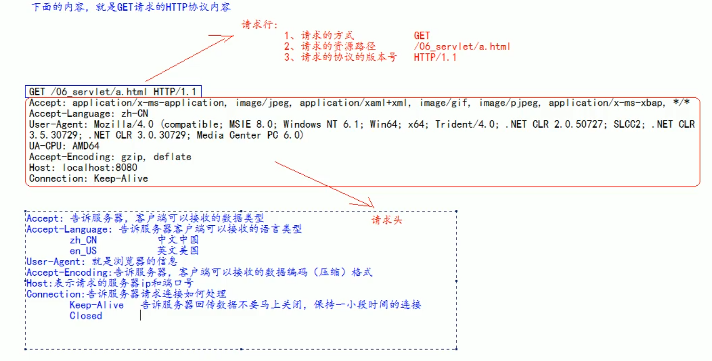
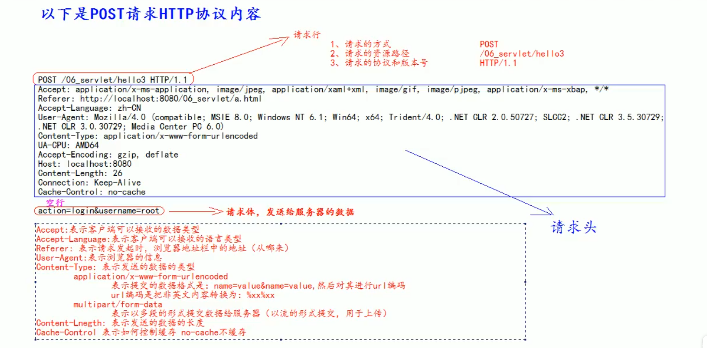

# Http 协议

## 什么是HTTP协议

什么是协议？
    - 协议是指双方，或多方，相互约定号，大家都需要遵循的规则，叫协议

所谓的HTTP协议，就是值，客户端和服务器之间通信时，发送的数据，需要遵守的规则，叫HTTP协议

HTTP协议中的数据又叫做报文

## 请求的HTTP协议格式

客服端给服务器发送数据叫请求。  
服务器给客户端回传数据叫响应。

请求分为GET请求和POST请求两种

### GET 请求

1. 请求行
   1. 请求的方式   GET
   2. 请求的资源路径(+？+参数 )   
   3. 请求的协议的版本号   HTTP/1.1
2. 请求头
   1. key:value 组成， 不同的键值对，表示不同的含义

### PSET 请求

1. 请求行
    1. 请求的方式   GET
    2. 请求的资源路径(+？+参数 )
    3. 请求的协议的版本号   HTTP/1.1
2. 请求头
    1. key:value 组成， 不同的键值对，表示不同的含义
3. 空行
4. 请求体：发送给服务器的数据

### 什么是GET请求，什么是POST请求？

常见的GET请求有：
1. form标签 method=get
2. a 标签
3. link 标签引入 css
4. Script 标签引入js 文件
5. img 标签引入图片
6. iframe 引入html 页面
7. 在刘敛起地址栏中输入地址后敲回车

常见的POST请求：
1. form 标签 method=post

### 响应的HTTP 协议格式

响应行：
1. 响应的协议 HTTP/1.1
2. 响应状态码 200
3. 响应状态描述符 OK

响应头：
1. Server：宝石服务器的信息
2. Content——Type：表示响应体的数据类型
3. Content—Length：响应题的长度
4. Data：请求响应的时间

空行

响应体：

### 常用的响应码

- 200：请求成功
- 302：请求重新定向
- 404：请求服务器已经收到了，但是你要的数据不存在（请求地址错误）
- 500：表示服务器已近收到请求，但是服务器内部错误（代码错误）