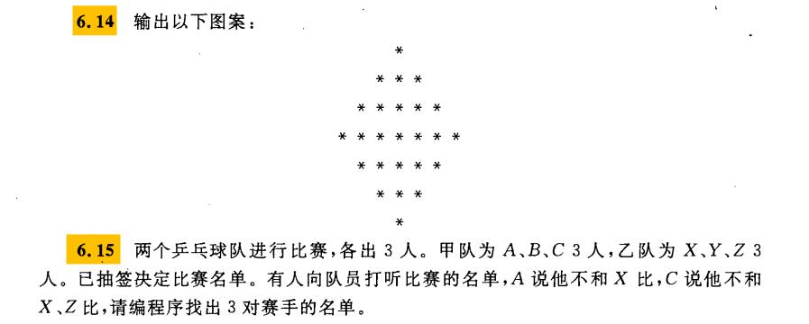

# 第一题

```java
/**
 * 
 */
package homework;

/**
 * @author 26465
 *
 */

import java.util.Scanner;

public class Exercise6_1 {
	public static void main(String[] args) {
		Scanner in = new Scanner(System.in);

		System.out.println("请输入第一个正整数：");
		int m = in.nextInt();
		System.out.println("请输入第二个正整数：");
		int n = in.nextInt();
		
		int max = (m > n) ? m : n;//最小公倍数肯定比两个数中的大数还要大，所以将大数放到max里。

		for (int i = max; i < m * n; i++) {// 从max开始，最小公倍数不可能大于两数的乘积。
			if (i % m == 0 && i % n == 0) {// 循环判断，这个数可以被两个数整除，那么这个数就是两个数的最小公倍数。
				System.out.println("最小公倍数是：" + i);
				break;
			}
		}

		int c;

		while (m % n != 0) {//辗转相除法
			c = m % n;
			m = n;
			n = c;
		}
		System.out.println("最大公约数是：" + n);


	}

}

```

运行结果：


# 第二题

```java
package homework;

import java.util.Scanner;

public class Exercise6_2 {
	public static void main(String[] args) {
		Scanner in = new Scanner(System.in);

		System.out.println("请输入一行字符串：");
		String str = in.nextLine();

		// 统计字符数
		int ziMu = 0; // 字母
		int shuZi = 0;// 数字
		int kongGe = 0;// 空格
		int other = 0;// 其他字符

		for (int i = 0; i < str.length(); i++) {// length()方法可以获取字符串长度
			char ch = str.charAt(i); // 将字符串转换为单个字符，然后对每个字符进行判断
			if ((ch >= 'a' && ch <= 'z') || (ch >= 'A' && ch <= 'Z')) {
				ziMu++;
			} else if (ch >= '0' && ch <= '9') {
				shuZi++;
			} else if (ch == ' ') {
				kongGe++;
			} else {
				other++;
			}

		}
		System.out.println("其中字母有" + ziMu + "个，数字有" + shuZi + "个，空格有" + kongGe + "个，其他字符有" + other + "个。");
	}

}

```

运行结果：


# 第三题

```java
package homework;

import java.util.Scanner;

public class Exercise6_3 {
	public static void main(String[] args) {
		Scanner in = new Scanner(System.in);

		System.out.println("请输入这个数字的位数：");
		int n = in.nextInt();
		int a = 0;
		int sum = 0;

		// 每有一位，就循环一次
		for (int i = 0; i < n; i++) {
			a = a * 10 + 2; // 以2为例，2 22 222 2222 可以发现规律 a*10+2
			sum = sum + a;  //将所有的结果加起来
		}
		System.out.println(sum);
	}

}

```

运行结果：


# 第四题

```java
package homework;

public class Exercise6_4 {
	public static void main(String[] args) {
		int sum = 1;
		int sum2 = 0;
		int n = 5;
		for (int i = 1; i <= n; i++) {
				sum =sum * i; //计算阶乘
				sum2 = sum2 + sum; // 将阶乘加起来
		}
		System.out.println(n + "的阶乘的和是：" + sum2);
	}

}

```

运行结果：


# 第五题

```java
package homework;

public class Exercise6_6 {
	public static void main(String[] args) {
		
		for (int i = 100; i <= 999; i++) { //因为是三位数，所以是从100开始，到999结束
			int b = i / 100;  // 取百位数字
			int s = i /10 % 10; // 取十位数字
			int g = i % 10; // 取个位数字
			
			if (i == (b * b * b + s * s * s + g * g * g)) { 
				//如果满足各个位的三次方等于i，那么就输出这个数
				System.out.println(i);
			}
		}
	}

}

```

运行结果：


# 第六题

```java
package homework;

public class Exercise6_7 {
	public static void main(String[] args) {
		int sum = 0;
		for (int i = 1; i <= 1000; i++) {  //循环1000次
			for (int j = 1; j < i; j++) { //所有小于i的数。
				
				if (i % j == 0) { //如果求余==0，说明j就是i的因子
					sum = sum + j; //将所有因子加起来
				}
			}
			if (sum == i) { //如果所有因子的和等于 i
				System.out.printf("%d its factors are ",i); // 按格式输出
				System.out.print(1); //1是所有数字的因子，所以直接输出
				for (int j = 2; j < sum; j++) { //j从2开始，找sum的因子
					if (sum % j == 0) { //判断是不是因子
						System.out.print("," + j); //如果是就输出这个因子
					}
				}
				System.out.println();
			}
			sum = 0; //内层循环结束后，重置sum为0
		}
	}

}

```

运行结果：


# 第七题

```java
package homework;

public class Exercise6_9 {
	public static void main(String[] args) {
		
		double hight = 100; //设置高度位100
		int count = 0; // 统计弹跳次数
		double sum = 100; // 经过的路线，因为初始高度是100， 多以球必定经过100米。
		while(count < 10) { // 统计反弹10次。
			hight /= 2; // 每次高度除以2
			sum = sum + hight; //将每次的路线加起来
			count++; //根本计数器
		}
		
		System.out.println("球共经过"+ sum +"米。\n第"+count+"次反弹的高度为"+ hight +"米。");
		
	}

}

```


# 第八题

```java
package homework;

public class Exercise6_10 {

	public static void main(String[] args) {
		int peach = 1;
		for (int i = 0; i < 9; i++) { // 计算第一天的桃子，所以往回推9天
			// 正算的话是 peach / 2 - 1；所以倒着往回推就是 (peach + 1) * 2
			peach = (peach + 1) * 2; 
		}
//		System.out.println("树上共有"+ peach+"个桃子");
//		peach = peach / 2 - 1;  //本来打算计算树上共有的桃子数
//		 然后根据桃子数计算第一天摘了的，后来发现回推9天和这个计算结果是一样的。
		System.out.println("第一天摘了" + peach + "个桃子");

	}

}

```

运行结果：


# 第九题

```java
package homework;

public class Exercise6_14 {
	public static void main(String[] args) {
		for (int i = 1; i <= 4; i++) {
			for (int j = 1; j <= 4 - i; j++) {
				System.out.print("  ");
			}
			for (int m = 1; m <= 2 * i - 1; m++) {
				System.out.print("* ");
			}
			System.out.println();
		}
		
		for (int i = 0; i < 4; i++) {
			
			for (int j = 0; j <= i; j++) {
				System.out.print("  ");
			}
			
			for (int j = 0; j < 5 - i * 2; j++) {
				System.out.print("* ");
			}
			System.out.println();
		}
		

	}

}

```

运行结果：


# 第十题

```java
package homework;

public class Exercise6_15 {
	public static void main(String[] args) {
		// 定义两队队员
		String[] first = { "A", "B", "C" }; // 甲队
		String[] second = { "X", "Y", "Z" };// 乙队

		
		// 循环便利数组
		for (int i = 0; i < 3; i++) {
			for (int j = 0; j < 3; j++) {
				String game = first[i] + second[j]; // 将比赛的队员放到一起
				if (game.equals("AX") || game.equals("CX") || game.equals("CZ")) {
					// 应为A不和X大，C不和X，Y打，所以，如果条件成立的话，就返回执行，不打印输出
					continue;
				}
				System.out.println("甲队队员" + first[i] + " 对阵 " + "乙队队员" + second[j]);
			}

		}

	}

}

```

运行结果：

