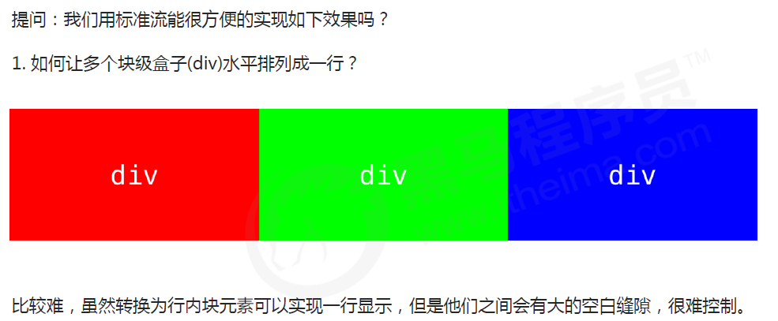

## 外边距（margin）

margin 属性用于设置外边距，即控制盒子和盒子之间的距离。

#### 外边距典型应用

外边距可以让块级盒子水平居中，但是必须满足两个条件：
① 盒子必须指定了宽度（width）。
② 盒子左右的外边距都设置为 auto 。

~~~html
.header{ width:960px; margin:0 auto;}
~~~

常见的写法，以下三种都可以：
 margin-left: auto; margin-right: auto;
 margin: auto;
 margin: 0 auto;

注意：以上方法是让块级元素水平居中，行内元素或者行内块元素水平居中给其父元素添加 text-align:center 即可。

#### 外边距合并

使用 margin 定义块元素的垂直外边距时，可能会出现外边距的合并。

##### 相邻块元素垂直外边距的合并

当上下相邻的两个块元素（兄弟关系）相遇时，如果上面的元素有下外边距 margin-bottom，下面的元素有上外边距 margin-top ，则他们之间的垂直间距不是 margin-bottom 与 margin-top 之和。取两个值中的较大者这种现象被称为相邻块元素垂直外边距的合并。

解决方案：
尽量只给一个盒子添加 margin 值。

##### 嵌套块元素垂直外边距的塌陷

对于两个嵌套关系（父子关系）的块元素，父元素有上外边距同时子元素也有上外边距，此时父元素会塌陷较大的外边距值。

解决方案：
①可以为父元素定义上边框。
②可以为父元素定义上内边距。
③可以为父元素添加 overflow:hidden。

##### 清除内外边距

网页元素很多都带有默认的内外边距，而且不同浏览器默认的也不一致。因此我们在布局前，首先要清除下网页元素的内外边距。

~~~html
* {
	padding:0; /* 清除内边距 */
	margin:0; /* 清除外边距 */
}
~~~

注意：行内元素为了照顾兼容性，尽量只设置左右内外边距，不要设置上下内外边距。但是转换为块级和行内块元素就可以了

## 圆角边框

在 CSS3 中，新增了圆角边框样式，这样我们的盒子就可以变圆角了。

border-radius 属性用于设置元素的外边框圆角。

~~~html
border-radius:length;
~~~

参数值可以为数值或百分比的形式

如果是正方形，想要设置为一个圆，把数值修改为高度或者宽度的一半即可，或者直接写为 50%

该属性是一个简写属性，可以跟四个值，分别代表左上角、右上角、右下角、左下角

分开写：border-top-left-radius、border-top-right-radius、border-bottom-right-radius 和 border-bottom-left-radius

## 盒子阴影

CSS3 中新增了盒子阴影，我们可以使用 box-shadow 属性为盒子添加阴影。

~~~html
box-shadow: h-shadow v-shadow blur spread color inset;
~~~

注意：
1. 默认的是外阴影(outset), 但是不可以写这个单词,否则造成阴影无效
2. 盒子阴影不占用空间，不会影响其他盒子排列。

## 文字阴影

在 CSS3 中，我们可以使用 text-shadow 属性将阴影应用于文本。

~~~html
text-shadow: h-shadow v-shadow blur color;
~~~

## 浮动（float)

传统网页布局的三种方式

网页布局的本质——用 CSS 来摆放盒子。 把盒子摆放到相应位置.

CSS 提供了三种传统布局方式(简单说,就是盒子如何进行排列顺序)：

普通流（标准流）
浮动
定位

##### 标准流（普通流/文档流）

所谓的标准流: 就是标签按照规定好默认方式排列.

1. 块级元素会独占一行，从上向下顺序排列。

  常用元素：div、hr、p、h1~h6、ul、ol、dl、form、table

2. 行内元素会按照顺序，从左到右顺序排列，碰到父元素边缘则自动换行。

   常用元素：span、a、i、em 等

   以上都是标准流布局，我们前面学习的就是标准流，标准流是最基本的布局方式。

这三种布局方式都是用来摆放盒子的，盒子摆放到合适位置，布局自然就完成了。

为什么需要浮动？

总结： 有很多的布局效果，标准流没有办法完成，此时就可以利用浮动完成布局。 因为浮动可以改变元素标签默认的排列方式.
浮动最典型的应用：可以让多个块级元素一行内排列显示。
网页布局第一准则：多个块级元素纵向排列找标准流，多个块级元素横向排列找浮动。

##### 浮动

float 属性用于创建浮动框，将其移动到一边，直到左边缘或右边缘触及包含块或另一个浮动框的边缘。

~~~html
选择器 { float: 属性值; }
~~~

##### 浮动特性（重难点）

加了浮动之后的元素,会具有很多特性,需要我们掌握的.
1.浮动元素会脱离标准流(脱标)
2.浮动的元素会一行内显示并且元素顶部对齐
3.浮动的元素会具有行内块元素的特性.

设置了浮动（float）的元素最重要特性：

1.脱离标准普通流的控制（浮） 移动到指定位置（动）, （俗称脱标）

2.浮动的盒子不再保留原先的位置

如果多个盒子都设置了浮动，则它们会按照属性值一行内显示并且顶端对齐排列。

注意： 浮动的元素是互相贴靠在一起的（不会有缝隙），如果父级宽度装不下这些浮动的盒子， 多出的盒子会另起一行对齐。

浮动元素会具有行内块元素特性。

任何元素都可以浮动。不管原先是什么模式的元素，添加浮动之后具有行内块元素相似的特性。
 如果块级盒子没有设置宽度，默认宽度和父级一样宽，但是添加浮动后，它的大小根据内容来决定
 浮动的盒子中间是没有缝隙的，是紧挨着一起的
行内元素同理

##### 浮动元素经常和标准流父级搭配使用

为了约束浮动元素位置, 我们网页布局一般采取的策略是:
先用标准流的父元素排列上下位置, 之后内部子元素采取浮动排列左右位置. 符合网页布局第一准侧.

