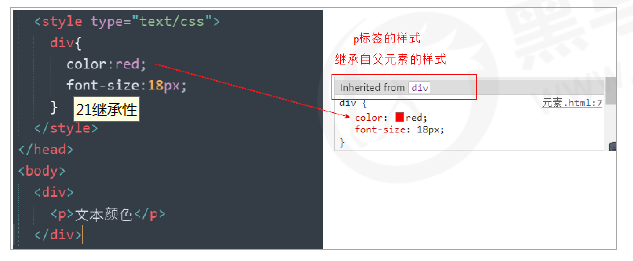
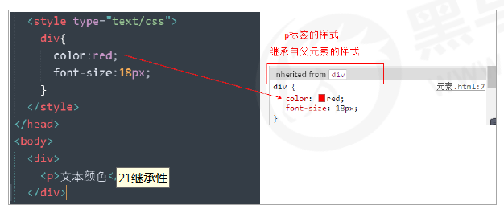
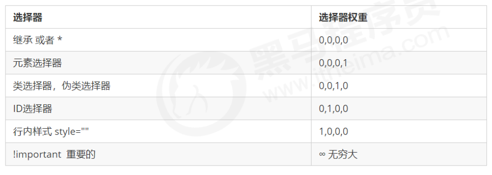
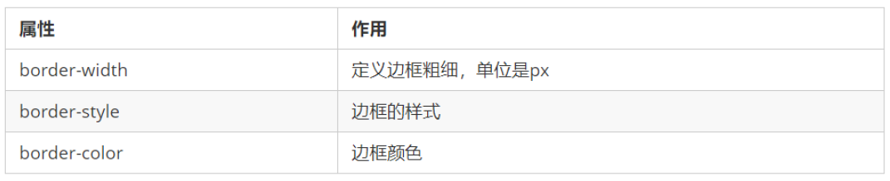
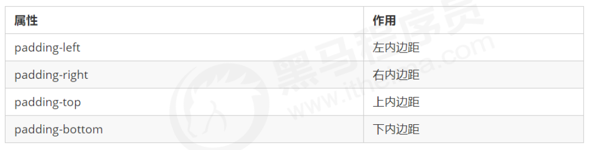
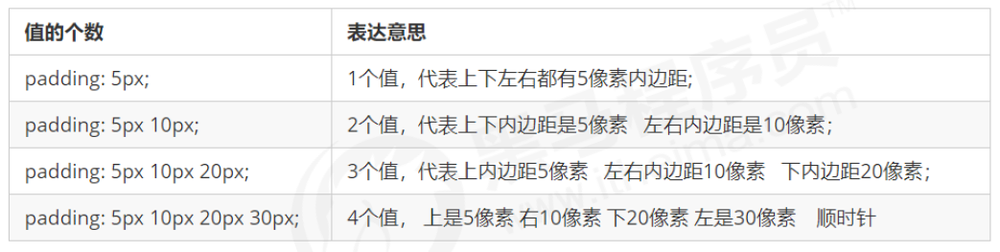

## CSS 的三大特性

CSS 有三个非常重要的三个特性：层叠性、继承性、优先级。

#### 层叠性

相同选择器给设置相同的样式，此时一个样式就会覆盖（层叠）另一个冲突的样式。层叠性主要解决样式冲突的问题

 样式冲突，遵循的原则是就近原则，哪个样式离结构近，就执行哪个样式

 样式不冲突，不会层叠

 恰当地使用继承可以简化代码，降低 CSS 样式的复杂性
 子元素可以继承父元素的样式（text-，font-，line-这些元素开头的可以继承，以及color属性）
 继承性口诀：龙生龙，凤生凤，老鼠生的孩子会打洞

#### 继承性

现实中的继承: 我们继承了父亲的姓

CSS中的继承: 子标签会继承父标签的某些样式，如文本颜色和字号。简单的理解就是：子承父业。

 恰当地使用继承可以简化代码，降低 CSS 样式的复杂性
 子元素可以继承父元素的样式（text-，font-，line-这些元素开头的可以继承，以及color属性）
 继承性口诀：龙生龙，凤生凤，老鼠生的孩子会打洞

##### 行高的继承性

~~~html
body {
	font:12px/1.5 Microsoft YaHei；
}
~~~

行高可以跟单位也可以不跟单位

如果子元素没有设置行高，则会继承父元素的行高为 1.5

此时子元素的行高是：当前子元素的文字大小 * 1.5

body 行高 1.5 这样写法最大的优势就是里面子元素可以根据自己文字大小自动调整行高

#### 优先级

当同一个元素指定多个选择器，就会有优先级的产生。

选择器相同，则执行层叠性

选择器不同，则根据选择器权重执行

## 盒子模型

页面布局要学习三大核心, 盒子模型, 浮动 和 定位. 学习好盒子模型能非常好的帮助我们布局页面.

网页布局过程：
1. 先准备好相关的网页元素，网页元素基本都是盒子 Box 。
2. 利用 CSS 设置好盒子样式，然后摆放到相应位置。
3. 往盒子里面装内容.
网页布局的核心本质： 就是利用 CSS 摆盒子。

#### 盒子模型（Box Model）组成

所谓 盒子模型：就是把 HTML 页面中的布局元素看作是一个矩形的盒子，也就是一个盛装内容的容器。
CSS 盒子模型本质上是一个盒子，封装周围的 HTML 元素，它包括：边框、外边距、内边距、和 实际内容

#### 边框（border）

border可以设置元素的边框。边框有三部分组成:边框宽度(粗细) 边框样式 边框颜色

~~~html
border : border-width || border-style || border-color
~~~

CSS 边框属性允许你指定一个元素边框的样式和颜色。

~~~html
border : border-width || border-style || border-color
~~~

边框样式 border-style 可以设置如下值：
 none：没有边框即忽略所有边框的宽度（默认值）
 solid：边框为单实线(最为常用的)
 dashed：边框为虚线
 dotted：边框为点线

边框简写：

~~~html
border: 1px solid red; 没有顺序
~~~

边框分开写法：

~~~html
border-top: 1px solid red; /* 只设定上边框， 其余同理 */
~~~

#### 表格的细线边框

border-collapse 属性控制浏览器绘制表格边框的方式。它控制相邻单元格的边框。

~~~html
border-collapse:collapse;
~~~

collapse 单词是合并的意思
border-collapse: collapse; 表示相邻边框合并在一起

#### 边框会影响盒子实际大小

边框会额外增加盒子的实际大小。因此我们有两种方案解决:
1.测量盒子大小的时候,不量边框.
2.如果测量的时候包含了边框,则需要 width/height 减去边框宽度

#### 内边距（padding）

padding 属性用于设置内边距，即边框与内容之间的距离。

padding 属性（简写属性）可以有一到四个值。

